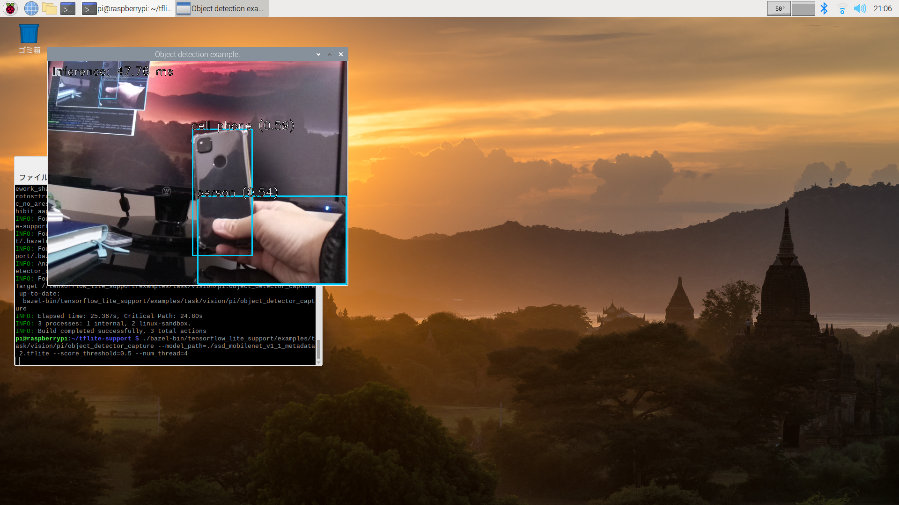
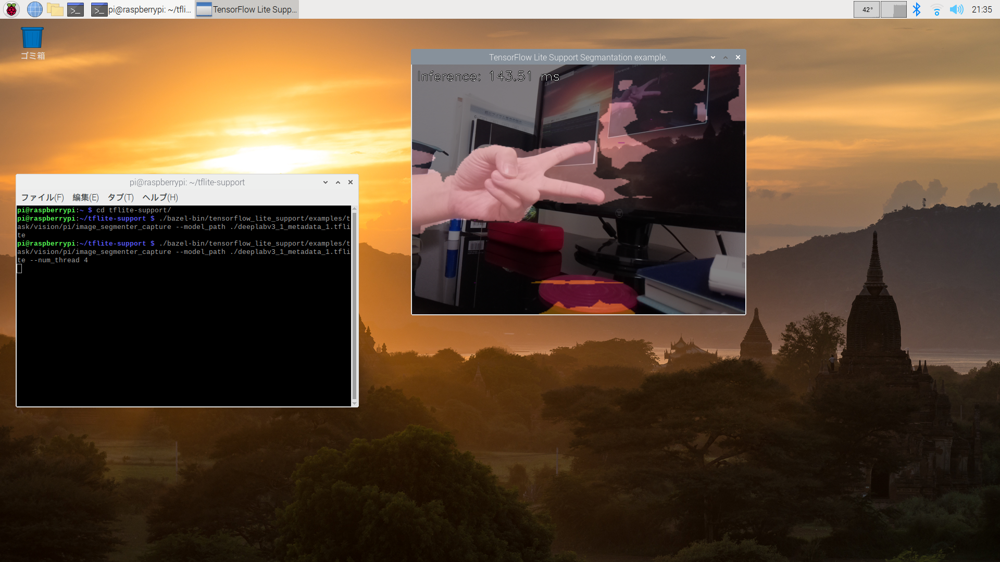

# Raspberry Pi examples for C++ Vision Task APIs

This folder contains simple Raspberry pi for easily trying out the C++
Vision Task APIs.

## Environment
- Raspberry Pi 4 (Raspberry Pi OS 64bit)
- PiCamera or UVC Camera

## Installation
```bash
# Install required library
$ sudo apt install git libopencv-dev

# Install build tool. Only native build. Cross-compile (W.I.P)
$ wget https://github.com/bazelbuild/bazel/releases/download/3.7.2/bazel-3.7.2-linux-arm64
$ chmod +x bazel-3.7.2-linux-arm64
$ sudo mv bazel-3.7.2-linux-arm64 /usr/local/bin/bazel
$ sudo apt install openjdk-11-jdk
```

## Image Classifier

### Prerequisites

You will need:

* a TFLite image classification model (e.g. [aiy/vision/classifier/birds_V1][1], a bird classification model available on TensorFlow Hub).

### Usage

In the console, run:

```bash
# Build module (top directory):
$ bazel build \
  --verbose_failures \
  tensorflow_lite_support/examples/task/vision/pi/image_classifier_capture

# Download the model:
$ curl \
 -L 'https://tfhub.dev/google/lite-model/aiy/vision/classifier/birds_V1/3?lite-format=tflite' \
 -o ./aiy_vision_classifier_birds_V1_3.tflite

# Run the classification tool:
$ ./bazel-bin/tensorflow_lite_support/examples/task/vision/pi/image_classifier_capture \
  --model_path=./aiy_vision_classifier_birds_V1_3.tflite \
  --num_thread=4
```


Exit with ese or q key.<br>

### Full command-line options.
```bash
$ ./bazel-bin/tensorflow_lite_support/examples/task/vision/pi/object_detector_capture --help
object_detector_capture: Warning: SetProgramUsageMessage() never called

  Flags from tensorflow_lite_support/examples/task/vision/pi/object_detector_capture.cc:
    --class_name_blacklist (Comma-separated list of class names that acts as a
      blacklist. If non-empty, detections results whose 'class_name' is in this
      list are filtered out. Mutually exclusive with 'class_name_whitelist'.);
      default: ;
    --class_name_whitelist (Comma-separated list of class names that acts as a
      whitelist. If non-empty, detections results whose 'class_name' is not in
      this list are filtered out. Mutually exclusive with
      'class_name_blacklist'.); default: ;
    --max_results (Maximum number of detection results to display.); default: 5;
    --model_path (Absolute path to the '.tflite' object detector model.);
      default: "";
    --num_thread (The number of threads to be used for TFLite ops that support
      multi-threading when running inference with CPU.num_threads should be
      greater than 0 or equal to -1. Setting num_threads to -1 has the effect to
      let TFLite runtime set the value.); default: -1;
    --score_threshold (Detection results with a confidence score below this
      value are rejected. If specified, overrides the score threshold(s)
      provided in the TFLite Model Metadata. Ignored otherwise.);
      default: -3.40282347e+38;

Try --helpfull to get a list of all flags.
```

## Object Detector


### Prerequisites

You will need:

* a TFLite object detection model (e.g. [ssd_mobilenet_v1][2], a generic object
detection model available on TensorFlow Hub),

### Usage

In the console, run:

```bash
# Build module (top directory):
$ bazel build \
  --verbose_failures \
  tensorflow_lite_support/examples/task/vision/pi/object_detector_capture

# Download the model:
$ curl \
 -L 'https://tfhub.dev/tensorflow/lite-model/ssd_mobilenet_v1/1/metadata/2?lite-format=tflite' \
 -o ./ssd_mobilenet_v1_1_metadata_2.tflite

# Run the detection tool:
$ ./bazel-bin/tensorflow_lite_support/examples/task/vision/pi/object_detector_capture \
  --model_path=./ssd_mobilenet_v1_1_metadata_2.tflite \
  --score_threshold=0.5 \
  --num_thread=4
```


Exit with ese or q key.<br>

### Full command-line options.
```bash
$ ./bazel-bin/tensorflow_lite_support/examples/task/vision/pi/object_detector_capture --help
object_detector_capture: Warning: SetProgramUsageMessage() never called

  Flags from tensorflow_lite_support/examples/task/vision/pi/object_detector_capture.cc:
    --class_name_blacklist (Comma-separated list of class names that acts as a
      blacklist. If non-empty, detections results whose 'class_name' is in this
      list are filtered out. Mutually exclusive with 'class_name_whitelist'.);
      default: ;
    --class_name_whitelist (Comma-separated list of class names that acts as a
      whitelist. If non-empty, detections results whose 'class_name' is not in
      this list are filtered out. Mutually exclusive with
      'class_name_blacklist'.); default: ;
    --max_results (Maximum number of detection results to display.); default: 5;
    --model_path (Absolute path to the '.tflite' object detector model.);
      default: "";
    --num_thread (The number of threads to be used for TFLite ops that support
      multi-threading when running inference with CPU.num_threads should be
      greater than 0 or equal to -1. Setting num_threads to -1 has the effect to
      let TFLite runtime set the value.); default: -1;
    --score_threshold (Detection results with a confidence score below this
      value are rejected. If specified, overrides the score threshold(s)
      provided in the TFLite Model Metadata. Ignored otherwise.);
      default: -3.40282347e+38;

Try --helpfull to get a list of all flags.
```

## Image Segmenter


### Prerequisites

You will need:

* a TFLite image segmentation model (e.g. [deeplab_v3][3], a generic segmentation model available on TensorFlow Hub).

### Usage

In the console, run:

```bash
# Build module (top directory):
$ bazel build \
  --verbose_failures \
  tensorflow_lite_support/examples/task/vision/pi/image_segmenter_capture

# Download the model:
$ curl \
  -L 'https://tfhub.dev/tensorflow/lite-model/deeplabv3/1/metadata/1?lite-format=tflite'  \
  -o ./deeplabv3_1_metadata_1.tflite

# Run the segmantation tool:
$ ./bazel-bin/tensorflow_lite_support/examples/task/vision/pi/image_segmenter_capture \
  --model_path=./deeplabv3_1_metadata_1.tflite \
  --num_thread=4
```

- Exit with ese or q key.
- Space key: Switching the display image(segmentation map or segmentation image).

### Full command-line options.
```bash
$ $ ./bazel-bin/tensorflow_lite_support/examples/task/vision/pi/image_segmenter_capture --help
image_segmenter_capture: Warning: SetProgramUsageMessage() never called

  Flags from tensorflow_lite_support/examples/task/vision/pi/image_segmenter_capture.cc:
    --model_path (Absolute path to the '.tflite' image segmenter model.);
      default: "";
    --num_thread (The number of threads to be used for TFLite ops that support
      multi-threading when running inference with CPU.num_threads should be
      greater than 0 or equal to -1. Setting num_threads to -1 has the effect to
      let TFLite runtime set the value.); default: -1;

Try --helpfull to get a list of all flags.
```

[1]: https://tfhub.dev/google/lite-model/aiy/vision/classifier/birds_V1/3
[2]: https://tfhub.dev/tensorflow/lite-model/ssd_mobilenet_v1/1/metadata/2
[3]: https://tfhub.dev/tensorflow/lite-model/deeplabv3/1/metadata/2
